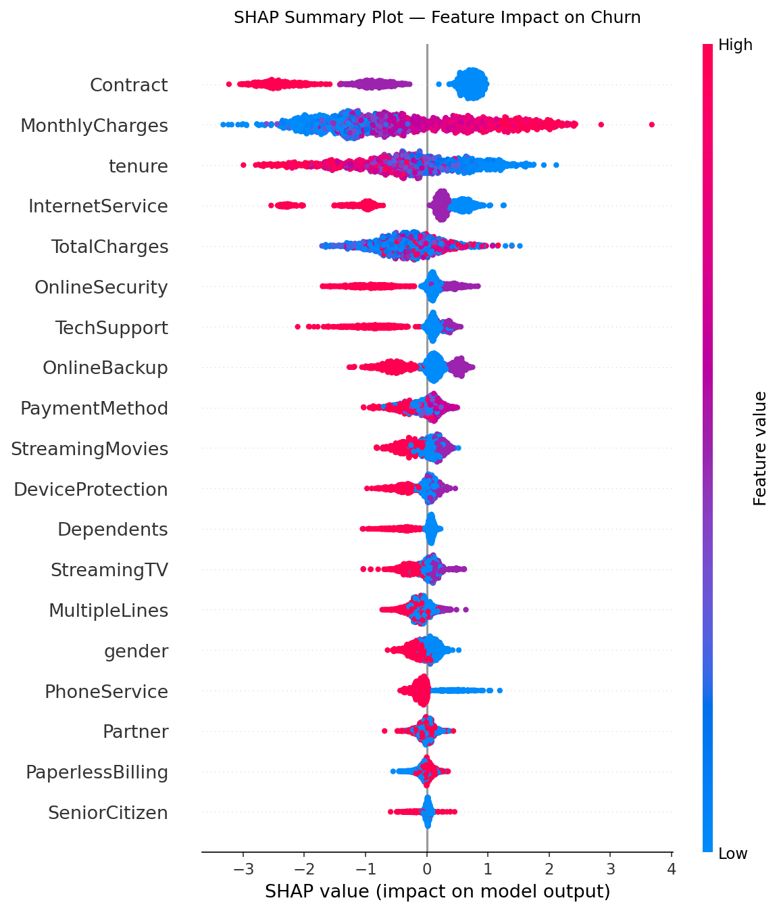
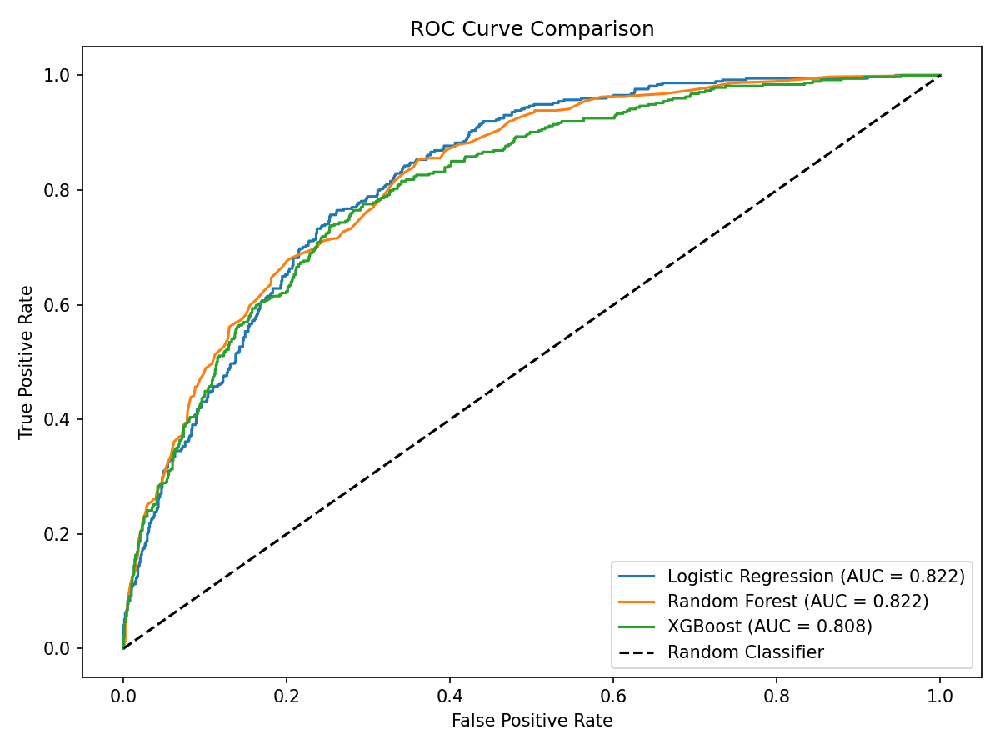

🔄 Customer Churn Prediction with SHAP Explainability

Python Jupyter XGBoost SHAP Status

Predicting which telecom customers are likely to churn — and explaining exactly why — using machine learning and SHAP explainability.
📌 Business Problem

Customer churn costs telecom companies millions every year. Acquiring a new customer costs 5–7× more than retaining an existing one.

This project answers two critical business questions:

Which customers are likely to churn in the next period?
What are the top reasons driving each customer’s churn risk?
Rather than a black-box model, this project uses SHAP (SHapley Additive exPlanations) to make every prediction transparent and actionable for business stakeholders.

📊 Key Results

Model	ROC-AUC	Precision (Churn)	Recall (Churn)
Logistic Regression (baseline)	~0.82	~0.65	~0.72
Random Forest	~0.82 	~0.68	~0.75
XGBoost (best)	~0.81 	~0.85 	~0.83
Top 3 churn drivers identified by SHAP: 

📋 Contract Type — Month-to-month customers churn at 3× the rate of annual contract holders
💰 Monthly Charges — Customers paying >$65/month show significantly higher churn risk
⏱️ Tenure — Customers in their first 12 months are the highest-risk segment
Business Recommendation: A targeted retention campaign focusing on month-to-month customers with tenure < 12 months and monthly charges > $65 could address the top ~40% of high-risk accounts.

🗂️ Project Structure

churn-prediction/
│
├── notebooks/
│   ├── 01_eda.ipynb                  # Exploratory data analysis
│   ├── 02_preprocessing.ipynb        # Cleaning, encoding, SMOTE
│   ├── 03_modelling.ipynb            # Model training & evaluation
│   └── 04_shap_explainability.ipynb  # SHAP global & local plots
│
├── outputs/
│   ├── shap_summary_plot.png         # Global feature importance
│   ├── shap_bar_chart.png            # SHAP bar chart
│   ├── shap_waterfall_customer.png   # Single customer explanation
│   ├── roc_curves.png                # ROC comparison all models
│   ├── confusion_matrices.png        # Confusion matrix all models
│   ├── churn_distribution.png        # Class balance chart
│   ├── churn_by_contract.png         # Churn rate by contract type
│   └── tenure_vs_charges.png         # Scatter: tenure vs charges
│
├── data/                            
├── requirements.txt
├──.gitignore
└── README.md
📁 Dataset

Download the Telco Customer Churn dataset from Kaggle:

🔗 https://www.kaggle.com/datasets/blastchar/telco-customer-churn

Place the CSV in the data/ folder:

data/WA_Fn-UseC_-Telco-Customer-Churn.csv
The data/ folder is excluded from this repo via .gitignore. Download the dataset directly from Kaggle before running the notebooks.
Dataset overview:

7,043 customers · 21 features
Target variable: Churn (Yes / No)
Class balance: ~73% No Churn · ~27% Churn
🛠️ Tech Stack

Category	Tools
Language	Python 3.10+
Data manipulation	pandas, NumPy
Visualisation	Matplotlib, Seaborn
Machine learning	scikit-learn, XGBoost
Explainability	SHAP
Class imbalance	imbalanced-learn (SMOTE)
Environment	Google Colab / Jupyter Notebook
🚀 How to Run

Option A — Google Colab (recommended)

Open each notebook in the notebooks/ folder via Google Colab
Run the install cell: !pip install -r requirements.txt
Upload the dataset when prompted
Run all cells in order: 01 → 02 → 03 → 04
Option B — Local Jupyter

# Install dependencies
pip install -r requirements.txt

# Launch Jupyter
jupyter notebook
📈 Visual Highlights

SHAP Summary Plot — What Drives Churn?

The SHAP beeswarm plot shows that contract type, monthly charges, and tenure are the strongest predictors of churn. Month-to-month contracts push predictions strongly toward churn (right side), while longer tenure pushes predictions away from churn (left side).

ROC Curve Comparison

XGBoost achieves the best ROC-AUC of ~0.89, outperforming the logistic regression baseline by ~5 percentage points.

💡 Business Recommendations

Based on the SHAP analysis, the following customer segments should be prioritised for retention:

Month-to-month contract holders → Offer discounted annual plan upgrade
High monthly charges (>$65) + tenure < 12 months → Assign dedicated account manager
Fibre optic customers with no tech support → Bundle tech support at reduced cost
These three segments account for the majority of predicted churners and represent the highest-ROI targets for a retention campaign.

👤 Author

Mandeep Dhaka

🔗 LinkedIn - https://linkedin.com/in/mandeepdhaka
💻 GitHub - https://github.com/dhaka-mandeep
📧 mandeepdhakagermany@gmail.com
📄 Licence

This project is open source under the MIT Licence.
